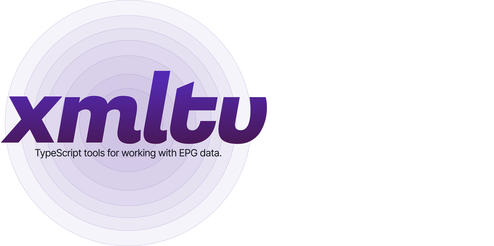

<div align="center">
  <picture>
    <source media="(prefers-color-scheme: dark)" srcset="./logo-dark.svg">
    
  </picture>

# @iptv/xmltv

An extremely fast XMLTV parser and generator for Node and the browser. <br>Lightweight, dependency-free, and easy to use.

---

[](https://www.npmjs.com/package/@iptv/xmltv)
[](https://github.com/ektotv/xmltv/actions/workflows/ci.yml)
[](https://github.com/ektotv/xmltv/tree/main/tests)
[](LICENSE.md)

</div>

---

The average XMLTV file is pretty large, smaller ones around 20MB and larger ones exceeding hundreds of megabytes. The purpose of this library is to facilitate rapid parsing and creation of these files.

---

## ✨ Features

- **Extremely** fast XMLTV parser and generator
- Lightweight (3.74 kB gzipped)
- No dependencies
- ESM and CommonJS support
- Supports Node and the browser
- Types that define an Xmltv interface, which implements the [XMLTV DTD](https://github.com/XMLTV/xmltv/blob/master/xmltv.dtd) as closely as possible
- Supports **all** XMLTV elements and attributes
- Did I mention [it's fast](#-performance)?

---

## 📥 Installation

To install this library, use the following command:

```bash
# pnpm
pnpm add @iptv/xmltv

# npm
npm install @iptv/xmltv

# yarn
yarn add @iptv/xmltv
```

---

## 🔧 Usage

To use this library in your project, first import the functions you need:

```typescript
import { parseXmltv, parseXmltv } from "@iptv/xmltv";
```

Then, you can parse an XMLTV file and receive back an `Xmltv` object:

<details>
  <summary>Example XMLTV File</summary>

Examples will be based on this XMLTV file, it can be found in the [tests/fixtures](tests/fixtures) directory.

```xml
<?xml version="1.0" encoding="UTF-8"?>
<!DOCTYPE tv SYSTEM "xmltv.dtd">

<tv date="20220401000000 +0000" source-info-name="example" source-info-url="example.com" source-data-url="example.com/a" generator-info-name="Example Generator"
  generator-info-url="example generator url">
  <channel id="channel_one">
    <display-name lang="en">Channel One</display-name>
    <icon src="https://example.com/channel_one_icon.jpg" width="100" height="100" />
    <url system="example">https://example.com/channel_one</url>
    <url system="other_system">https://example.com/channel_one_alternate</url>
  </channel>
  <channel id="channel_two">
    <display-name>Channel Two: Minimum valid channel</display-name>
  </channel>
  <programme start="20220331180000 +0000" stop="20220331190000 +0000" channel="channel_one"
    pdc-start="20220331180000 +0000" vps-start="20220331180000 +0000" showview="12345"
    videoplus="67890" clumpidx="0/1">
    <title lang="en">Programme One</title>
    <sub-title lang="en">Pilot</sub-title>
    <desc lang="en">This programme entry showcases all possible features of the DTD</desc>
    <credits>
      <director>Samuel Jones</director>
      <actor role="Walter Johnson">David Thompson</actor>
      <actor role="Karl James" guest="yes"> Ryan Lee <image type="person">https://www.example.com/xxx.jpg</image>
        <url system="moviedb">https://www.example.com/person/204</url>
      </actor>
      <writer>Samuel Jones</writer>
      <adapter>William Brown</adapter>
      <producer>Emily Davis</producer>
      <composer>Max Wright</composer>
      <editor>Nora Peterson</editor>
      <presenter>Amanda Johnson</presenter>
      <commentator>James Wilson</commentator>
      <guest>Lucas Martin</guest>
      <guest>Emily Parker</guest>
      <guest>Oliver Nelson</guest>
    </credits>
    <date>20220401000000 +0000</date>
    <category lang="en">Crime</category>
    <category lang="en">Drama</category>
    <keyword lang="en">methamphetamine</keyword>
    <keyword lang="en">cancer</keyword>
    <language>English</language>
    <orig-language lang="en">French</orig-language>
    <length units="minutes">60</length>
    <icon src="https://example.com/programme_one_icon.jpg" width="100" height="100" />
    <url system="tvdb">https://example.com/programme_one</url>
    <url> https://example.com/programme_one_2</url>
    <country>US</country>
    <episode-num system="onscreen">S01E01</episode-num>
    <episode-num system="xmltv_ns">1.1.</episode-num>
    <video>
      <present>yes</present>
      <colour>no</colour>
      <aspect>16:9</aspect>
      <quality>HDTV</quality>
    </video>
    <audio>
      <present>yes</present>
      <stereo>Dolby Digital</stereo>
    </audio>
    <previously-shown start="20220331180000 +0000" channel="channel_two" />
    <premiere>First time on British TV</premiere>
    <last-chance lang="en">Last time on this channel</last-chance>
    <new />
    <subtitles type="teletext">
      <language>English</language>
    </subtitles>
    <subtitles type="onscreen">
      <language lang="en">Spanish</language>
    </subtitles>
    <rating system="BBFC">
      <value>15</value>
      <icon src="15_symbol.png" />
    </rating>
    <star-rating system="TV Guide">
      <value> 4/5</value>
      <icon src="stars.png" />
    </star-rating>
    <review type="text" source="Rotten Tomatoes" reviewer="Joe Bloggs" lang="en">This is a fantastic show!</review>
    <review type="url" source="Rotten Tomatoes" reviewer="Joe Bloggs" lang="en">https://example.com/programme_one_review</review>
    <image type="poster" size="1" orient="P" system="tvdb">https://tvdb.com/programme_one_poster_1.jpg</image>
    <image type="backdrop" size="3" orient="L" system="tvdb"> https://tvdb.com/programme_one_backdrop_3.jpg</image>
  </programme>
  <programme start="20220331180000 +0000"
    channel="channel_one">
    <title>Programme Two: The minimum valid programme</title>
  </programme>
</tv>
```

</details>

```typescript
const xml = `...`; // XMLTV file contents
const xmltv: Xmltv = parseXmltv(xml);
const programmes: XmltvProgramme[] = xmltv.programmes;
const channels: XmltvChannel[] = xmltv.channels;
```

<details>
  <summary>Example output of `parseXmltv()`</summary>

```typescript
{
  channels: [
    {
      displayName: [
        {
          _value: "Channel One",
          lang: "en",
        },
      ],
      icon: [
        {
          height: 100,
          src: "https://example.com/channel_one_icon.jpg",
          width: 100,
        },
      ],
      id: "channel_one",
      url: [
        {
          _value: "https://example.com/channel_one",
          system: "example",
        },
        {
          _value: "https://example.com/channel_one_alternate",
          system: "other_system",
        },
      ],
    },
    {
      displayName: [
        {
          _value: "Channel Two: Minimum valid channel",
        },
      ],
      id: "channel_two",
    },
  ],
  date: new Date("2022-04-01T00:00:00.000Z"),
  generatorInfoName: "Example Generator",
  generatorInfoUrl: "example generator url",
  programmes: [
    {
      audio: {
        present: true,
        stereo: "Dolby Digital",
      },
      category: [
        {
          _value: "Crime",
          lang: "en",
        },
        {
          _value: "Drama",
          lang: "en",
        },
      ],
      channel: "channel_one",
      clumpidx: "0/1",
      country: {
        _value: "US",
      },
      credits: {
        actor: [
          {
            _value: "David Thompson",
            role: "Walter Johnson",
          },
          {
            _value: "Ryan Lee",
            guest: true,
            image: [
              {
                _value: "https://www.example.com/xxx.jpg",
                type: "person",
              },
            ],
            role: "Karl James",
            url: [
              {
                _value: "https://www.example.com/person/204",
                system: "moviedb",
              },
            ],
          },
        ],
        adapter: [
          {
            _value: "William Brown",
          },
        ],
        commentator: [
          {
            _value: "James Wilson",
          },
        ],
        composer: [
          {
            _value: "Max Wright",
          },
        ],
        director: [
          {
            _value: "Samuel Jones",
          },
        ],
        editor: [
          {
            _value: "Nora Peterson",
          },
        ],
        guest: [
          {
            _value: "Lucas Martin",
          },
          {
            _value: "Emily Parker",
          },
          {
            _value: "Oliver Nelson",
          },
        ],
        presenter: [
          {
            _value: "Amanda Johnson",
          },
        ],
        producer: [
          {
            _value: "Emily Davis",
          },
        ],
        writer: [
          {
            _value: "Samuel Jones",
          },
        ],
      },
      date: new Date("2022-04-01T00:00:00.000Z"),
      desc: [
        {
          _value:
            "This programme entry showcases all possible features of the DTD",
          lang: "en",
        },
      ],
      episodeNum: [
        {
          _value: "S01E01",
          system: "onscreen",
        },
        {
          _value: "1.1.",
          system: "xmltv_ns",
        },
      ],
      icon: [
        {
          height: 100,
          src: "https://example.com/programme_one_icon.jpg",
          width: 100,
        },
      ],
      image: [
        {
          _value: "https://tvdb.com/programme_one_poster_1.jpg",
          orient: "P",
          size: 1,
          system: "tvdb",
          type: "poster",
        },
        {
          _value: "https://tvdb.com/programme_one_backdrop_3.jpg",
          orient: "L",
          size: 3,
          system: "tvdb",
          type: "backdrop",
        },
      ],
      keyword: [
        {
          _value: "methamphetamine",
          lang: "en",
        },
        {
          _value: "cancer",
          lang: "en",
        },
      ],
      language: {
        _value: "English",
      },
      lastChance: {
        _value: "Last time on this channel",
        lang: "en",
      },
      length: {
        _value: 60,
        units: "minutes",
      },
      new: true,
      origLanguage: {
        _value: "French",
        lang: "en",
      },
      pdcStart: new Date("2022-03-31T18:00:00.000Z"),
      premiere: {
        _value: "First time on British TV",
      },
      previouslyShown: {
        channel: "channel_two",
        start: new Date("2022-03-31T18:00:00.000Z"),
      },
      rating: [
        {
          icon: [
            {
              src: "15_symbol.png",
            },
          ],
          system: "BBFC",
          value: "15",
        },
      ],
      review: [
        {
          _value: "This is a fantastic show!",
          lang: "en",
          reviewer: "Joe Bloggs",
          source: "Rotten Tomatoes",
          type: "text",
        },
        {
          _value: "https://example.com/programme_one_review",
          lang: "en",
          reviewer: "Joe Bloggs",
          source: "Rotten Tomatoes",
          type: "url",
        },
      ],
      showview: "12345",
      starRating: [
        {
          icon: [
            {
              src: "stars.png",
            },
          ],
          system: "TV Guide",
          value: "4/5",
        },
      ],
      start: new Date("2022-03-31T18:00:00.000Z"),
      stop: new Date("2022-03-31T19:00:00.000Z"),
      subTitle: [
        {
          _value: "Pilot",
          lang: "en",
        },
      ],
      subtitles: [
        {
          language: {
            _value: "English",
          },
          type: "teletext",
        },
        {
          language: {
            _value: "Spanish",
            lang: "en",
          },
          type: "onscreen",
        },
      ],
      title: [
        {
          _value: "Programme One",
          lang: "en",
        },
      ],
      url: [
        {
          _value: "https://example.com/programme_one",
          system: "tvdb",
        },
        {
          _value: "https://example.com/programme_one_2",
        },
      ],
      video: {
        aspect: "16:9",
        colour: false,
        present: true,
        quality: "HDTV",
      },
      videoplus: "67890",
      vpsStart: new Date("2022-03-31T18:00:00.000Z"),
    },
    {
      channel: "channel_one",
      start: new Date("2022-03-31T18:00:00.000Z"),
      title: [
        {
          _value: "Programme Two: The minimum valid programme",
        },
      ],
    },
  ],
  sourceDataUrl: "example.com/a",
  sourceInfoName: "example",
  sourceInfoUrl: "example.com",
};

```

</details>

You can also generate an XMLTV file from an Xmltv DOM tree:

```typescript
const dom = objectToDom(xmltvObject);
const xml = parseXmltv(dom);
console.log(xml); //<tv>
```

If you want to go even faster you can parse the file into a DOM tree and then traverse it yourself:

```typescript
const xml = "..."; // XMLTV file contents
const parsed = parseXmltv(xml, { asDom: true });
// or import {parser} from '@iptv/xmltv';
// const parsed = parser(xml);

// `parsed` is now a list of XmltvNode objects
// which can be traversed using the `children` property
// and attributes can be accessed using the `attributes` property
// (see the XmltvNode interface for more details)

// this is not the most efficient way to do this, but it's a good example
const programmes = parsed
  .find((node) => {
    // find the <tv> tag
    return node.tagName === "tv";
  })
  .children.filter((node) => {
    // filter it's children for <programme> tags
    return node.tagName === "programme";
  })
  .map((programme) => {
    // return a Programme object for each <programme> tag
    return {
      title: programme.children.find((t) => t.tagName === "title").children[0],
      start: new Date(programme.attributes.start),
      stop: new Date(programme.attributes.stop),
      channel: programme.attributes.channel,
    };
  });
```

---

## ⚡ Performance

This library has been optimized for parsing and generating XMLTV files quickly and efficiently. In our benchmarks, it performs better than other popular XMLTV libraries, including [epg-parser](https://www.npmjs.com/package/epg-parser) and [xmltv](https://www.npmjs.com/package/xmltv). It also beats [fast-xml-parser](https://www.npmjs.com/package/fast-xml-parser).

The speed of this library is down to the implementation of the XML DOM tree parser [tXml](https://www.npmjs.com/package/txml). To learn more about the optimisations made by tXml please read [this blog post](https://tnickel.de/2020/08/30/2020-08-how-the-fastest-xml-parser-is-build/) by [@TobiasNickel](https://github.com/TobiasNickel).

### Benchmarks

<picture>
  
</picture>

#### Parsing XMLTV file (example.xml)

<table>
  <thead>
    <tr>
        <th align="left"></th>
        <th align="left">Library</th>
        <th align="left">Ops/sec</th>
        <th align="left">rme</th>
      </tr>
  </thead>
  <tbody>
    <tr>
      <td></td>
      <th align="left">@iptv/xmltv</th>
      <td align="right">21,219</td>
      <td align="right">±0.28</td>
    </tr>
    <tr>
      <td>🟢</td>
      <th align="left">@iptv/xmltv (DOM only)</th>
      <td align="right">34,632</td>
      <td align="right">±0.28%</td>
    </tr>
    <tr>
      <td></td>
      <th align="left">fast-xml-parser</th>
      <td align="right">6,803</td>
      <td align="right">±0.53%</td>
    </tr>
    <tr>
      <td></td>
      <th align="left">epg-parser</th>
      <td align="right">2,321</td>
      <td align="right">±0.42%</td>
    </tr>
    <tr>
      <td>🔴</td>
      <th align="left">xmltv</th>
      <td align="right">2,448</td>
      <td align="right">±1.90%</td>
    </tr>
</tbody>
</table>

#### Writing XMLTV file (example.xml)

<table>
  <thead>
    <tr>
      <th align="left"></th>
      <th align="left">Library</th>
      <th align="left">Ops/sec</th>
      <th align="left">rme</th>
    </tr>
  </thead>
  <tbody>
    <tr>
      <th align="left">🟢</th>
      <th align="left">@iptv/xmltv</th>
      <td align="right">93,292</td>
      <td align="right">±0.17%</td>
    </tr>
    <tr>
      <th align="left">🔴</th>
      <th align="left">fast-xml-parser</th>
      <td align="right">26,886</td>
      <td align="right">±0.16%</td>
    </tr>
  </tbody>
</table>

#### Time spent parsing different XMLTV files

<table>
  <thead>
    <tr>
      <th align="left"></th>
      <th align="left">Channels</th>
      <th align="right">1</th>
      <th align="right">100</th>
      <th align="right">100</th>
      <th align="right">100</th>
      <th align="right">100</th>
      <th align="right">100</th>
      <th align="right">1</th>
    </tr>
    <tr>
      <th align="left"></th>
      <th align="left">Programmes</th>
      <th align="right">0</th>
      <th align="right">100</th>
      <th align="right">10,000</th>
      <th align="right">100,000</th>
      <th align="right">250,000</th>
      <th align="right">500,000</th>
      <th align="right">1,000,000</th>
    </tr>
  </thead>
  <tbody>
    <tr>
      <th align="left">🟢</th>
      <th align="left">@iptv/xmltv</th>
      <td align="right">~340 μs</td>
      <td align="right">~1.67 ms</td>
      <td align="right">~83 ms</td>
      <td align="right">~535 ms</td>
      <td align="right">~1.13 s</td>
      <td align="right">~2.41 s</td>
      <td align="right">~5.61 s</td>
    </tr>
    <tr>
      <th align="left">🔴</th>
      <th align="left">epg-parser</th>
      <td align="right">~1.71 ms</td>
      <td align="right">~11 ms</td>
      <td align="right">~263 ms</td>
      <td align="right">~2.43 s</td>
      <td align="right">~5.7 s</td>
      <td align="right">~12 s</td>
      <td align="right">~29 s</td>
    </tr>
  </tbody>
</table>

<p><sup>I used nanobench to get the above times. Nanobench doesn't support the xmltv's event based architecture, so is not included in file parsing timings.</sup></p>

<p><sup>These benchmarks were run on a 2021 MacBook Pro M1 Max (10 cores) with 64 GB of RAM.</sup></p>

---

## 🎯 Future Goals

### Worker Support

Even though it's fast and it won't block for long, this will block your main thread whilst it runs. I'd like to add support for running the parser in a worker so it doesn't block at all.

### Streaming Support

My initial intent writing this library was to build a streaming parser, however I found the approach of [tXml](https://github.com/TobiasNickel/txml) to be much faster than other methods I tried. There are some issues upstream I'd like to help fix before I can add streaming support but it is something I'd like to do.

### CLI Module

A command line program that can be piped around to convert files from one format to another.

## 🚫 Non-Goals

### Generic XML Parsing

This library is designed to parse and generate XMLTV files only. It is not designed to be a generic XML parser or generator. If you need to parse generic XML files, you should use the excellent [tXml](https://github.com/TobiasNickel/txml) library instead.

### Altering the Shape of the Data

The shape of the `Xmltv` type is designed to match the [XMLTV DTD](https://raw.githubusercontent.com/XMLTV/xmltv/master/xmltv.dtd) as closely as possible. If you need a different object you can traverse the DOM tree yourself and convert it to your desired shape.

---

## 🤝 Contributing

Contributions are welcome! Even better if they align with the [future goals](#-future-goals).

You'll need to be able to run the tests and benchmarks. To do so, you will need to run the `./create-xml.sh` script in the `tests/fixtures` directory to generate the necessary fixture files.

To be accepted your PR must pass all tests and not negatively impact the benchmarks. Some commands to help you:

- `pnpm run test` - Run the vitest suite
- `pnpm run benny` - Run additional benchmarks
- `pnpm run benchmark` - Run the benchmarks with vitest
- `pnpm run nanobench` - Run additional benchmarks

This project uses [Changesets](https://github.com/changesets/changesets) to manage releases. For you, this just means your PR must come with an appropriate changeset file. If you're not sure how to do this, just ask and I'll be happy to help, or read the changesets documentation on [adding a changeset](https://github.com/changesets/changesets/blob/main/docs/adding-a-changeset.md).

## 📄 License & Credit

This library is licensed under the [MIT License](https://github.com/ektotv/xmltv/LICENSE.md) and is free to use in both open source and commercial projects.

The parser is based on the [tXml](https://github.com/TobiasNickel/txml) library by [@TobiasNickel](https://github.com/TobiasNickel).
